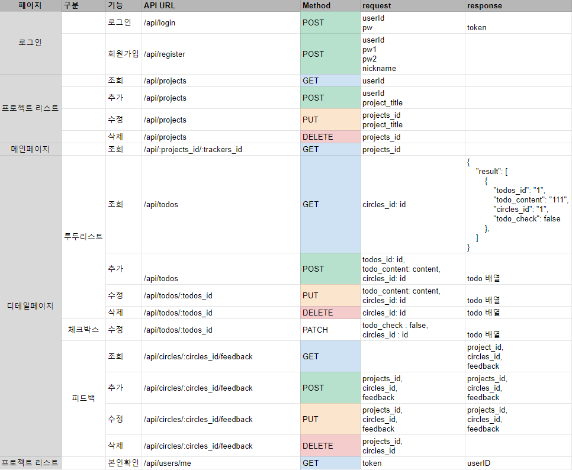
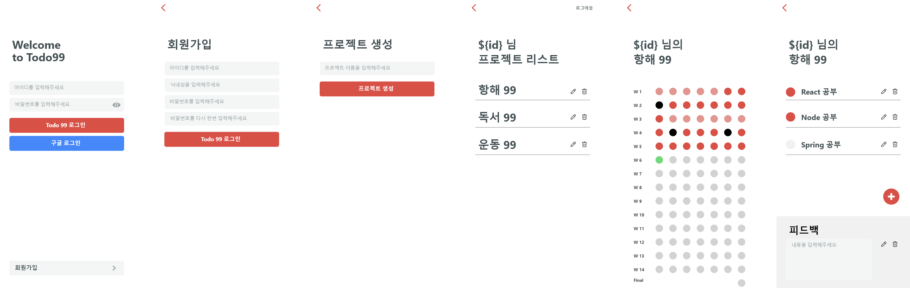

# ☑ Todo 99
👋 프로젝트 소개
99일 단위의 프로젝트 생성, todo list를 관리할 수 있습니다.

 

# 👨‍💻 프로젝트 기간 & 팀원
2021년 12월 6일 ~ 2021년 12월 11일 (총 5일)
- F.E : 공성훈, 정연재 (프론트엔드 깃헙 주소)
- B.E : 김희경, 이건희, 이성진 (https://github.com/Johnberman-J/mini-project)   
  
 

# 🔨 개발 도구
- Backend
  - Node.js 
  - Express 
  - MongoDB 
- Frontend 
  - React 

 

# 📖 핵심기능
로그인, 회원가입

JWT를 이용하여 로그인과 회원가입을 구현하였습니다. 
아이디와 닉네임의 중복확인이 가능합니다. 

Todo list, Feedback CRUD 

미들웨어를 이용, 지나간 일자의 체크리스트는 수정이 불가합니다. 
완성한 todo list 개수를 db에 저장, 메인 화면에서 시각효과를 주었습니다. (메인 페이지 색상변화)

 

# 📃 API 설계

 

# 🔨 트러블 슈팅
- 수정 모달창 생성시 input값이 남아서 초기화되지 않았던문제 
 ⇒ 모달창을 display block or none 이 아닌 {modal? 모달창 : null} 자체로 렌더링 여부를 판단해서 아예 새로 나타나게 해결했습니다. 

- 새로고침시 리덕스에 있는 닉네임정보가 날아가서 오류가 발생 
 ⇒ 로그인시 닉네임정보를 스토리지에 저장하고 로그아웃시 토큰과 함께 삭제했습니다 

- 이후 해결해야 할 문제 ref 잡아서 input 클리어하기

 

# 💻 실제 구동 이미지

 

# 🔗 담당 파트 
프론트 엔드 클라이언트를 맡아 제작하였습니다. 
회원가입시 백과 함께 회원가입 양식체크를 만들었고 
비밀번호에 아이디가 포함되어있으면 회원가입이 되지않게 만들었습니다. 

피드백 CRUD기능을 구현했습니다. 
디테일 페이지에서 todolist 체크시에 메인 화면에 색이 바뀌두록 구현했습니다. 
로그인 시 유저 정보중 닉네임과 아이디는 스토리지에 저장하여 로그아아웃시 
같이 사라지게 했습니다. 

